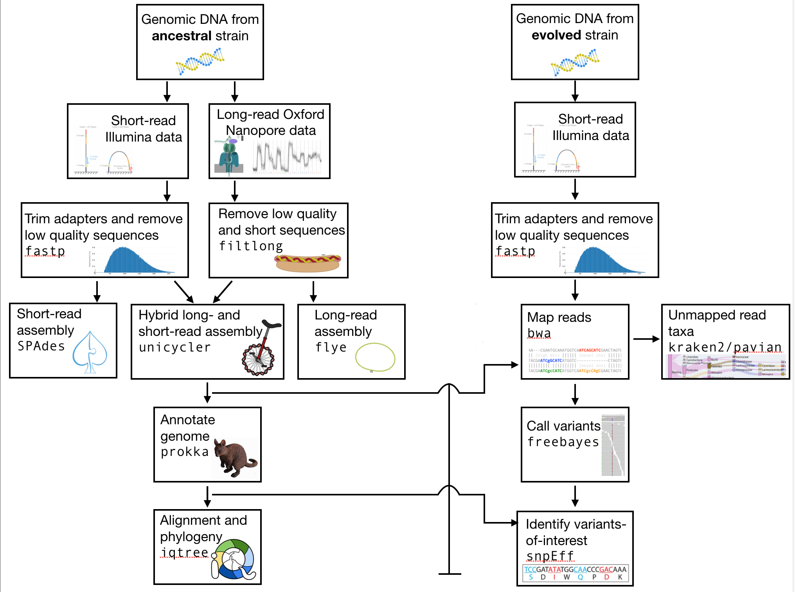

# `r fontawesome::fa("book", fill=" #4141f7")` : Workflow y herramientas en general

```{=html}
<link href="
https://cdn.jsdelivr.net/npm/bootstrap-icons@1.11.1/font/bootstrap-icons.min.css
" rel="stylesheet">
```



Dependiendo del objetivo y alcance del estudio es el flujo de trabajo a seguirse. Si se quiere comparar con otras cepas relacionadas o no. 


## Otras herramientas:

Además del flujo de trabajo ilustrado anteriormente, se pueden realizar otros análisis como:


### Anotación funcional 

1. **Prokka**
   - **Propósito:** Anotación rápida de genes, ARN y características genómicas.
   - **Entrada:** Archivo genómico en FASTA.
   - **Salida:** Archivos GFF, GBK, FAA (proteínas) y FFN (genes).
   - **Referencia:** [Prokka web page](https://github.com/tseemann/prokka){.external}

2. **RAST**
   - **Propósito:** Anotación de ORFs en subsistemas funcionales.
   - **Entrada:** Archivo genómico en FASTA.
   - **Salida:** GenBank anotado (.gbk), tablas de funciones y subsistemas.
   - **Referencia:** [RAST server](https://rast.nmpdr.org/){.external}

3. **eggNOG-mapper v5.0.2**
   - **Propósito:** Asignar COGs ortológicos y términos GO.
   - **Entrada:** Secuencias proteicas (FAA) de Prokka o RAST.
   - **Salida:** Tablas TSV con anotaciones ortológicas y GO.
   - **Referencia:** Huerta-Cepas et al. (2019) [eggNOG-mapper](http://eggnog-mapper.embl.de/){.external}

### Análisis funcional y rutas metabólicas

1. **dbCAN (Run_dbcan v3)**
   - **Propósito:** Identificar enzimas CAZymes.
   - **Entrada:** Secuencias proteicas en FASTA.
   - **Salida:** Informe TSV de familias CAZy.
   - **Referencia:** Zheng et al. (2023) [dbCAN](http://csbl.bmb.uga.edu/dbCAN2/){.external}

2. **BlastKOALA**
   - **Propósito:** Asignar proteínas a rutas KEGG.
   - **Entrada:** Secuencias proteicas.
   - **Salida:** Listado de KO (K numbers) y rutas.
   - **Referencia:** Kanehisa et al. (2016) [BlastKOALA](https://www.kegg.jp/blastkoala/){.external}
  
3. **iPath3.0 (KEGG)**
   - **Propósito:** Visualizar redes metabólicas.
   - **Entrada:** Listado de módulos KEGG.
   - **Salida:** Mapa interactivo SVG/HTML.
   - **Referencia:** Darzi et al. (2018) [iPath3.0](https://pathways.embl.de/){.external}

### Identificación de genes de resistencia y virulencia

1. **ResFinder 3.2**
   - **Propósito:** Detectar genes de resistencia antimicrobiana.
   - **Entrada:** Genoma o contigs en FASTA.
   - **Salida:** Tabla de genes con cobertura e identidad.
   - **Referencia:** Zankari et al. (2012) [ResFinder](https://cge.cbs.dtu.dk/services/ResFinder/){.external}

2. **Abricate**
   - **Propósito:** Cribado de genes específicos en bases de datos especializadas.
     - **RGs (Resistance Genes):** Genes asociados con resistencia antimicrobiana adquirida.
     - **VGs (Virulence Genes):** Genes que codifican factores de virulencia y patogenicidad.
     - **MGEs (Mobile Genetic Elements):** Elementos genéticos móviles (plásmidos, transposones, integrones).
   - **Entrada:** Secuencias genómicas en FASTA.
   - **Salida:** Tablas TSV con coincidencias.
   - **Referencia:** Seemann (2018) [Abricate](https://github.com/tseemann/abricate){.external}

   
### Detección de elementos móviles y defensa bacteriana

1. **CRISPRCasFinder**
   - **Propósito:** Identificar arrays CRISPR y cas.
   - **Entrada:** Genoma en FASTA.
   - **Salida:** GFF con coordenadas y tipo de sistema.
   - **Referencia:** Couvin et al. (2018) [CRISPRCasFinder](https://crisprcas.i2bc.paris-saclay.fr/){.external}

2. **PHASTER**
   - **Propósito:** Detectar profagos integrados.
   - **Entrada:** Genoma en FASTA/GBK.
   - **Salida:** Tabla de regiones prophage.
   - **Referencia:** Arndt et al. (2016) [PHASTER](http://phaster.ca/){.external}

### Localización de elementos genómicos especiales

1. **Island Viewer 4**
   - **Propósito:** Detectar islas genómicas y genes de patogenicidad.
   - **Entrada:** FASTA genómico.
   - **Salida:** Track GFF/JSON de islas.
   - **Referencia:** Bertelli et al. (2017) [Island Viewer 4](http://www.pathogenomics.sfu.ca/islandviewer/){.external}

2. **antiSMASH **
   - **Propósito:** Identificar BGCs.
   - **Entrada:** FASTA.
   - **Salida:** GBK anotados, JSON de BGCs y gráficos.
   - **Referencia:** Blin et al. (2021) [antiSMASH](https://antismash.secondarymetabolites.org/){.external}

3. **BAGEL 4.0**
   - **Propósito:** Encontrar bacteriocinas.
   - **Entrada:** Secuencias proteicas/genoma.
   - **Salida:** Informe HTML/TSV.
   - **Referencia:** van Heel et al. (2018) [BAGEL](http://bagel4.molgenrug.nl/){.external}

4. **BiG-SLiCE & BiG-FAM**
   - **Propósito:** Análisis a gran escala de BGCs para identificar familias y diversidad funcional.
   - **Entrada:** Colección de archivos GenBank o JSON de BGCs (p. ej., salidas de antiSMASH).
   - **Salida:** Agrupación de BGCs en familias (BiG-FAM) y mapas de similitud BGC (BiG-SLiCE).
   - **Referencia:** Kautsar et al. (2021) [BiG-SLiCE](https://github.com/medema-group/bigslice), Kautsar et al. (2021) [BiG-FAM](https://vcg.github.io/big-fam/){.external}

5. **CORASON & evoMining**
   - **Propósito:** Análisis comparativo y evolutivo de BGCs; identificación de genes accesorios y rutas evolutivas.
   - **Entrada:** Secuencias de BGCs anotadas (GenBank/JSON).
   - **Salida:** Árbol filogenético de BGCs (CORASON) y perfiles de evolución de dominios enzimáticos (evoMining).
   - **Referencia:** Navarro-Muñoz et al. (2020) [CORASON](https://github.com/nselem/corason), Cruz-Morales et al. (2016) [evoMining](https://github.com/lspampinato/evoMining){.external}

   - **Propósito:** Encontrar bacteriocinas.
   - **Entrada:** Secuencias proteicas/genoma.
   - **Salida:** Informe HTML/TSV.
   - **Referencia:** van Heel et al. (2018) [BAGEL](http://bagel4.molgenrug.nl/){.external}

### Análisis comparativo de pangenoma y contenido proteico

1. **Roary**
   - **Propósito:** Calcular core-genome y pangenoma.
   - **Entrada:** GFF de múltiples genomas.
   - **Salida:** gene_presence_absence.csv, árbol Newick.
   - **Referencia:** Page et al. (2015) [Roary](https://sanger-pathogens.github.io/Roary/){.external}

2. **OrthoVenn**
   - **Propósito:** Clustering de ortólogos y Venn.
   - **Entrada:** FASTA de proteínas.
   - **Salida:** Diagramas de Venn y tablas de clústeres.
   - **Referencia:** Wang et al. (2015) [OrthoVenn](https://orthovenn2.bioinfotoolkits.net/home){.external}


### Construcción de filogenias

1. **MUSCLE**
   - **Propósito:** Alineación múltiple de secuencias.
   - **Entrada:** FASTA proteico.
   - **Salida:** Archivo de alineación.
   - **Referencia:** Edgar (2004) [MUSCLE](https://www.drive5.com/muscle/){.external}

2. **RaxML**
   - **Propósito:** Árbol filogenético con bootstrap.
   - **Entrada:** Alineación.
   - **Salida:** Newick y soporte.
   - **Referencia:** Stamatakis (2014) [RAxML](https://cme.h-its.org/exelixis/web/software/raxml/){.external}

3. **SplitTree4**
   - **Propósito:** Árbol UPGMA de distancias.
   - **Entrada:** Matriz de distancias.
   - **Salida:** Diagrama UPGMA.
   - **Referencia:** Huson y Bryant (2006) [SplitTree4](https://software-ab.cs.uni-tuebingen.de/download/splitstree4/welcome.html){.external}

### Visualización y reporte final


1. **Scoary + GoFigure!**
   - **Propósito:** Enriquecimiento GO y visualización.
   - **Entrada:** gene_presence_absence.csv y anotaciones GO.
   - **Salida:** Tablas de enriquecimiento y gráficos.
   - **Referencia:** Brynildsrud et al. (2016) [Scoary](https://github.com/AdmiralenOla/Scoary), GoFigure! (2018).


2. **CGView**
   - **Visualiza:** GBK de RAST y antiSMASH.
   - **Salida:** Imagen circular PNG/SVG.
   - **Referencia:** Grant y Stothard (2008)
[CGView](https://cgview.ca/){.external}

3. **Proksee**
   - **Visualiza:** Archivos `.gb` de RAST.
   - **Salida:** Mapa circular interactivo.
   - **Referencia:** [Proksee](https://proksee.ca/){.external}

4. **BV-BRC**
   - **Visualiza:** Genoma y pangenoma; usa Mash/MinHash y PGFams.
   - **Salida:** Reporte HTML/PDF y árbol interactivo.
   - **Referencia:** [BV-BRC](https://www.bv-brc.org/){.external}
   
   